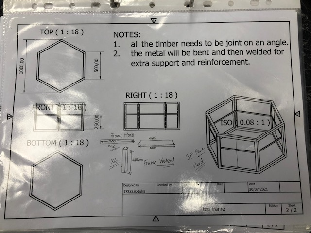
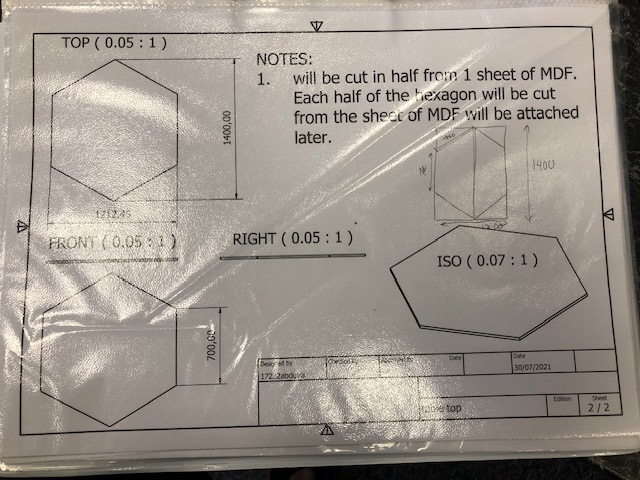
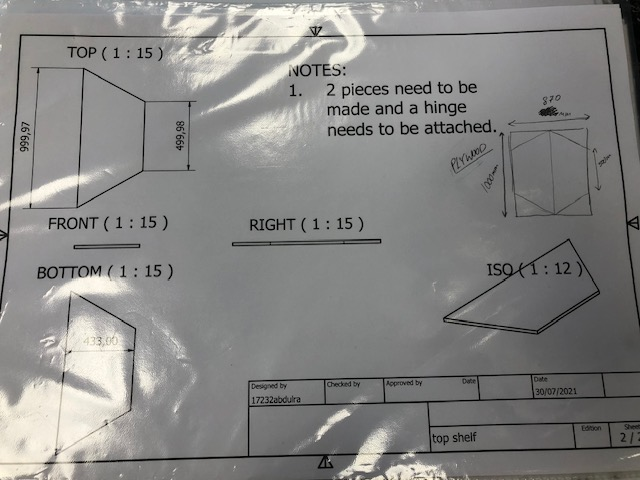
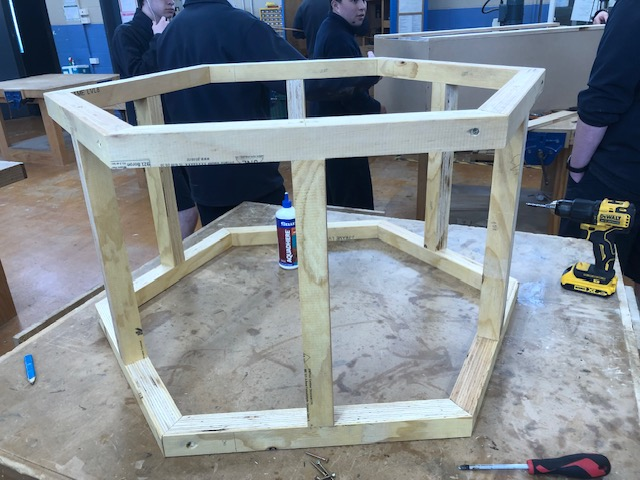
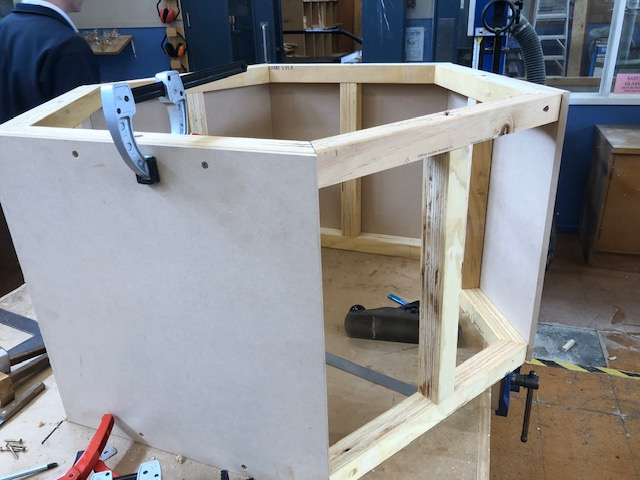
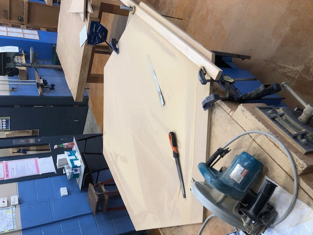
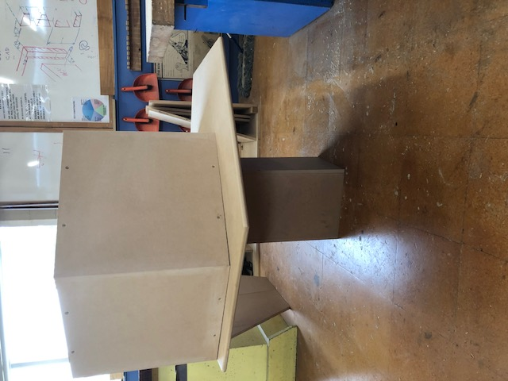
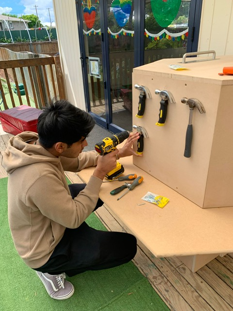
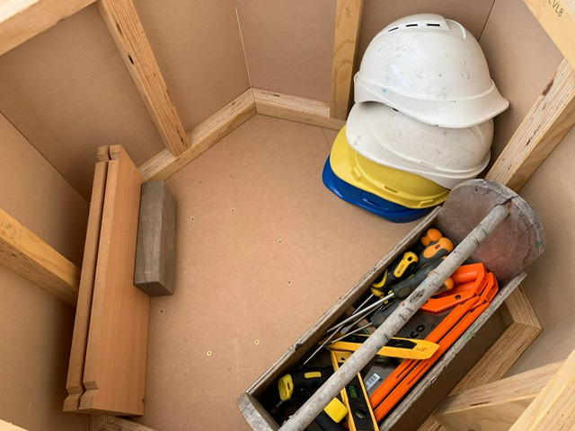

# Work bench for eary childhood kids

## 📌 Overview
This was my year 13 project for the course product design. I worked with a main client and stakeholders who gave me a problem and certain requirements that they needed for the product to have. For this project, the children had carpentry tools that did not have a proper storage space. The children also did not have a proper area to use the tools. My client and stakeholder wanted a custom built product to store the carpentry tools and an area for them to work.

## 🎯 Objectives
- Must be safe for children i.e. stable, proper finishing, sanded
- Hold carpentry items
- A big area for the children to use equipment

## 🛠 Tools & Concepts Used
- Inventor
- Carpentry tools and knowledge

## 🔍 Methodology
 The requirements from my client and stakholderes :  
- must be safe
- must hold carpentry items such as hammers, saws, helmets, screwdrivers, saws, shoes
- A table for the kids to use for their work
- Strong, hardy and stable
- Internal storage to put away all the items when closing up, preferrably with a lock and key
- Rounded edges around table top
 
After receiving the project requirements, I researched existing carpentry storage solutions and children’s workbench designs. The key concepts identified were incorporated into several design proposals, which were presented to the client and stakeholder. 

Once a final design was selected, I developed a detailed specification list to guide construction. The 3D model was used to determine precise dimensions and angles, and to generate an accurate parts list for fabrication.
 

### Frame and panel
The frame was constructed using treated timber. I created a detailed parts list for my teacher, who used a mitre saw to cut the members to the required angles. The hexagonal table design was selected to allow multiple children to work simultaneously. Compared to a rectangular workbench, the hexagonal configuration also provided additional panel surfaces for tool storage.  

The frame components were assembled using wood glue and screws. This stage was particularly challenging due to timber warping, which made alignment difficult. Clamps were used extensively to maintain positioning during assembly and ensure structural stability. 

After completing the frame, the MDF panels were attached. Accurate angle cuts were required to match the hexagonal geometry, making installation more complex. The panels were secured using glue and screws. Minor warping resulted in imperfect fitment in certain areas, which was corrected through sanding and incremental adjustments to achieve a clean and flush finish.

### Table top, support, and lid

The tabletop was constructed from MDF and cut into a hexagonal shape using a circular saw. A makeshift jig was used to maintain straight and consistent cuts. After shaping the panel, a router was used to round over the edges, and the surface was sanded to achieve a smooth and safe finish suitable for children. The base support consisted of a square MDF panel, assembled using wood glue and screws to provide structural stability. 

During assembly, an issue arose when the frame was positioned on top of the tabletop. The frame footprint was larger than anticipated, reducing the available working area for the children. To resolve this, the frame was repositioned toward the edge of the tabletop, and the base support was adjusted accordingly to maintain stability. This modification created three fully accessible working edges, while one panel was positioned to sit flush against a wall. The client and stakeholders reviewed and approved this design adjustment.  

The storage lid was fabricated from leftover MDF and cut into a matching hexagonal shape. Handles were installed for ease of use, and a locking mechanism was added to secure the stored tools.

## 📊 Results
- The table worked perfectly even with the change at the end.
- Housed all required equiment
- Lock worked well and ensured security
- Size and proportion of the table was apprpriate
- Client and stakeholders were happy with final product

## 📸 Project Images
### Drawings

### Frame and Panel

### Table top

### Final Product

## 📚 What I Learned
- How to work with client and stakeholders
- New tools and techniques
- How to deal with expensive mistakes
- Designing for children is more challenging than designing for adults due to size diferences and safety compliance

